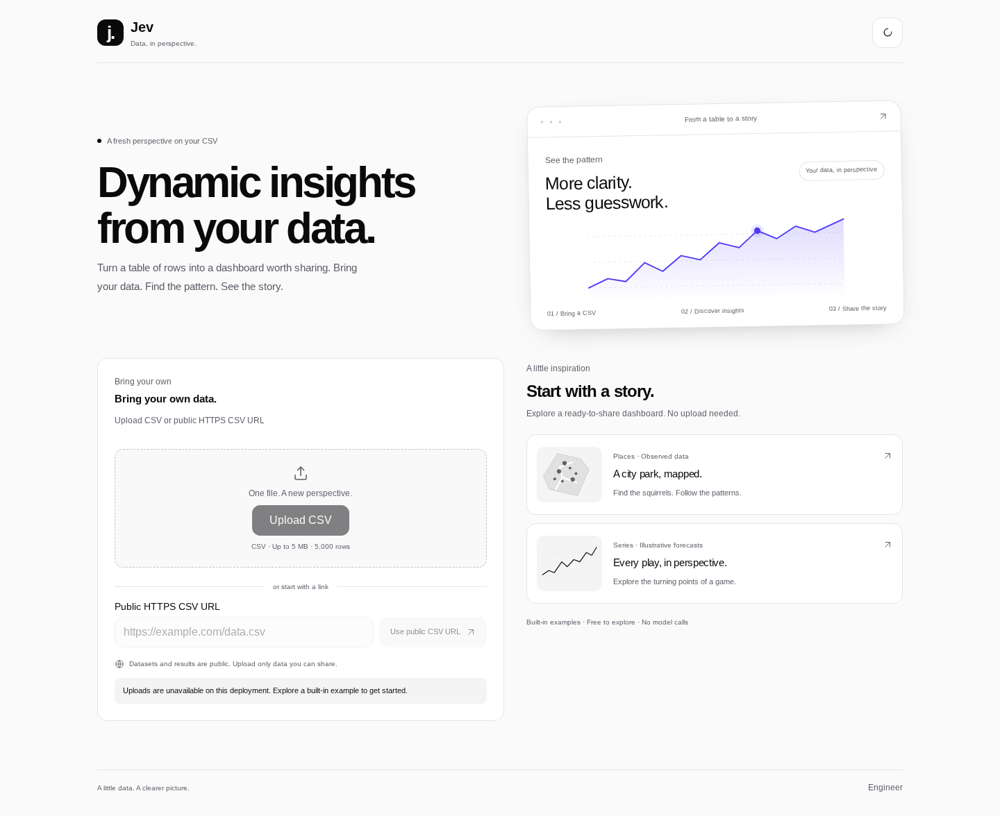
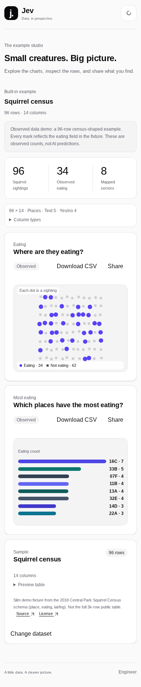
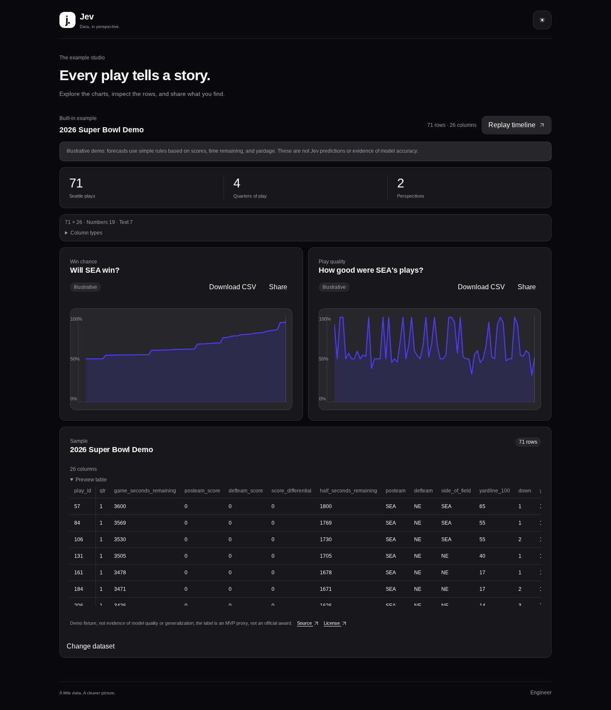

# Release audit — 2026-10-01

Audited and implemented from remote main `e2f5f43`. Scope: the shipped CSV/demo product, frontend state and charts, analysis lifecycle/providers, intake/network safety, durable Convex storage, deployment, and validation. Historical gamecast routes are outside the deployed surface.

## Crisp fix list

| Priority | Finding | Implemented fix |
| --- | --- | --- |
| P0 | Opening a dataset could begin paid generation/analysis. | Explicit Analyze dataset action; visiting/share/replay stays read-only; route changes suppress delayed starts. |
| P0 | Anonymous live calls lacked a durable deployment-wide bound; SDK retries bypassed accounting. | Atomic Convex UTC-day Jev/OpenRouter permits; missing budgets fail closed; every attempt counted; implicit SDK retries disabled; force-new disabled by default. |
| P0 | Public URL DNS checks were optional, sockets could resolve again, and bodies were buffered before the size check. | Validate all DNS answers and redirects, pin the TLS connection, reject reserved/transition address space, bound DNS/body time and streamed bytes, handle bodyless responses safely. |
| P0 | Signed URL query strings could enter public metadata. | Strip query/fragment before persistence; require blob storage before URL fetch. |
| P1 | No useful first-run experience without provisioned services. | Two instantly available local dashboards with observed/illustrative labels, no credential/API dependency, and a standalone demo deployment mode. |
| P1 | Sparse results could seek the wrong source row; edited earlier rows could remain stale. | Absolute source-row cursor mapping, corrected sparse seeks, and memo comparisons that observe earlier result/source changes. |
| P1 | Eating counts could be inferred from classifier values; unknown/malformed locations could appear as observations. | Counts use source truth only; unknown stays unknown; validate coordinate field names/bounds; retain useful observed charts alongside errors. |
| P1 | Transient poll failures stopped updates; failed tile starts had no recovery; terminal errors offered resume. | Retrying/backoff polling with recovered errors cleared, start retry, and retryability-aware resume. |
| P1 | Clipboard failures claimed success; only the lead tile exposed export/share; Score CSVs claimed probability. | Selectable-link fallback, actions on every completed tile, correct CSV metric names, sorted rows, preserved formula escaping. |
| P1 | Mobile/keyboard/accessibility defects and visually uneven chart headers. | 320-pixel layouts, bounded keyboard-scrollable tables, working React 18 inert folds, labeled progress bars, separate chart/control roles, readable contrast, consistent tile headers. |
| P2 | Landing lacked a clear product story and preview; release metadata/docs/checks were incomplete. | New visual hierarchy and native chart artwork, demo summary cards, discoverable timeline replay, light/dark design, social artwork with absolute deployment image URLs, current operator docs, CI browser checks. |

All fixes above are implemented. The demos distinguish observed counts and illustrative calculations from live model output; they do not claim model accuracy.

## Validation

- All 433 unit/component/server/Convex mock tests pass, including budget atomicity, counted retries, DNS pinning, streamed byte bounds, route races, sparse chart seeking, earlier-row edits, and start/poll recovery.
- Frontend production build and server/functions/Convex TypeScript checks pass. Browser bundle boundary guard passes.
- Football fixture validation passes; dependency audit reports zero vulnerabilities.
- Headless Chromium checks 30 combinations: landing, both demos, saved demo replay, and missing-share handling; light/dark; 1440/390/320 pixels. Zero automated WCAG 2 A/AA and 2.1 AA violations, horizontal page overflow, or JavaScript crashes. Exercises CSV downloads, blocked-clipboard fallback, replay keyboard controls, and the visible Replay timeline action. Demo routes make no API requests; browsing/export/share starts no paid requests.
- Social metadata validated with an HTTPS example deployment origin. Screenshots visually reviewed on desktop/mobile and in both themes.

## Release boundary

The standalone demo is ready to deploy with `DEMO_ONLY=1`; README documents the exact configuration. No external production deployment or paid-provider request was performed during validation. Real Convex, UploadThing, and Jev/OpenRouter integration still needs operator provisioning and a controlled live smoke test. Automated accessibility checks supplement the visual/keyboard review and do not prove exhaustive assistive-technology compatibility.

Live BYOD intentionally publishes uploaded data/results and has no private-data authentication. Call budgets limit outbound attempts, not dollar charges or total uploaded storage. Use the standalone mode for an unrestricted public demo; enabling anonymous live intake requires the operator to manage storage retention and service quotas. Pause/cancel and private workspaces remain future product work, rather than dependencies of the local demo.
